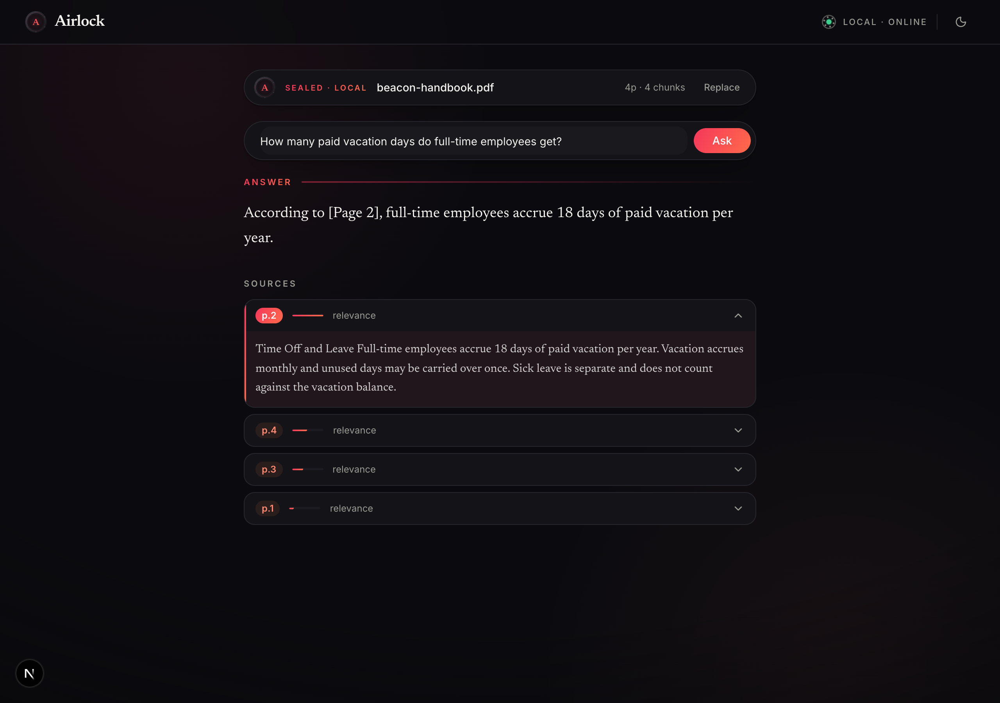
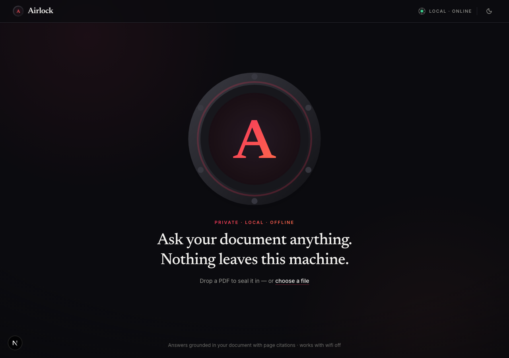
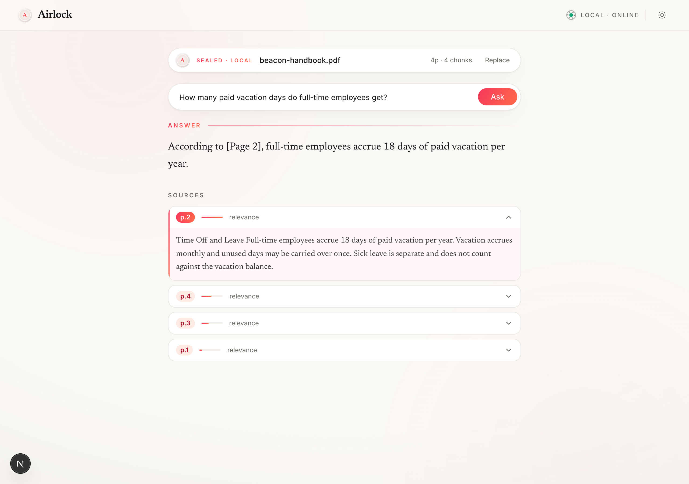

<p align="center">
  <picture>
    <source media="(prefers-color-scheme: dark)" srcset="frontend/public/wordmark-light.png">
    
  </picture>
</p>

<p align="center"><em>A private, fully-local PDF assistant — answers grounded in your document, with page citations.</em></p>

---

Upload a PDF, ask questions in plain language, and get answers grounded in that document with exact page citations. The entire inference path runs on your own machine via [LM Studio](https://lmstudio.ai/) — no document text, question, or answer ever leaves the device. **It works with wifi off.** (One caveat: the embedding model, ~90MB, is downloaded once from Hugging Face on the first upload and cached; after that, everything runs fully offline.)

<p align="center">
  
</p>

## How it works

```
PDF ──▶ FastAPI backend (:8000)                       Next.js frontend (:3000)
        ├─ extract text per page (PyMuPDF)            └─ upload + ask UI, streamed answer
        ├─ chunk each page (overlap within a page)       + expandable page citations
        ├─ embed chunks (sentence-transformers, CPU)
        ├─ retrieve top-K by cosine (NumPy)
        └─ stream answer (SSE) from LM Studio ◀── local llama-3.2-3b-instruct
```

Only the **retrieved chunks** are sent to the local model — never the full document. Embeddings run **in-process** in the backend so LM Studio only ever holds the 3B chat model (matters on 8GB machines). Design decisions and constraints are documented in [SPEC.md](SPEC.md).

## The interface — a sealed chamber

The UI dramatizes the privacy promise instead of just claiming it. The hero is a machined porthole hatch — the entire drop zone. Drop a PDF and the chamber **pressurizes** while pages index, then **seals** (the lock ring torques shut) and the hatch docks into a `SEALED · LOCAL` pill. Questions are asked into the chamber; the answer bleeds out through the glass token-by-token in serif type, with staggered citation cards showing page numbers and relative-relevance meters. The masthead carries a live engine indicator — a miniature of the hatch whose bolt ring idles when LM Studio is reachable, ratchets while checking, and visibly slips off-index when the engine is down.

- **Dark-first** with full light-theme support (system preference + one-button toggle, persisted)
- **Motion is CSS-first and GPU-only** (transform/opacity; no animation library), with a targeted `prefers-reduced-motion` pass that keeps loading feedback honest
- **Accessible**: state is never carried by color or motion alone; streamed answers announce calmly to screen readers; full keyboard path with visible focus
- **Installable PWA** (manifest + icons), OG/Twitter cards included
- Stack: Next.js 15 App Router, React 19 (TypeScript strict), Tailwind v4, shadcn/ui on Base UI, sonner

<p align="center">
  
</p>
<p align="center">
  
</p>

## Prerequisites

- [LM Studio](https://lmstudio.ai/) running with **`llama-3.2-3b-instruct`** loaded, serving the OpenAI-compatible API at `http://localhost:1234/v1`.
- Python **3.12** (PyTorch wheels are not yet published for 3.14).
- Node 20+ and `pnpm`.

## Run it

**Backend** (terminal 1):
```bash
cd backend
python3.12 -m venv .venv && ./.venv/bin/pip install -r requirements.txt
./.venv/bin/uvicorn app.main:app --workers 1 --reload --port 8000
```

**Frontend** (terminal 2):
```bash
cd frontend
cp .env.local.example .env.local
pnpm install
pnpm dev
```

Open <http://localhost:3000>, drop a PDF onto the hatch (a sample lives at `backend/sample/beacon-handbook.pdf`), and ask away.

## Configuration

All backend knobs are plain constants in [`backend/app/config.py`](backend/app/config.py) — no env vars: `LM_STUDIO_URL`, `MODEL_NAME` (must match the model identifier loaded in LM Studio), `EMBED_MODEL`, and the retrieval defaults `CHUNK_SIZE=800`, `CHUNK_OVERLAP=150`, `TOP_K=4`. Running a different local model means editing `MODEL_NAME` there. The frontend's only setting is `NEXT_PUBLIC_API_BASE` in `.env.local`.

## Verify (end-to-end)

```bash
curl -s localhost:8000/health
curl -s -F "file=@backend/sample/beacon-handbook.pdf" localhost:8000/upload
curl -N -s -X POST localhost:8000/ask -H 'Content-Type: application/json' \
  -d '{"question":"How many paid vacation days do full-time employees get?"}'
```

The first `ask` returns a `sources` event citing **page 2**, then streams the grounded answer. (The sample handbook is generated by `backend/sample/make_sample.py` with one known fact per page — that's why this question deterministically cites page 2.) Ask something not in the document and it honestly says it cannot find the answer.

Backend unit tests (no LM Studio required) and frontend typecheck:
```bash
cd backend && ./.venv/bin/pytest -q
cd frontend && pnpm typecheck
```

## Out of scope (v1)

Airlock v1 is deliberately **single-user, single-machine, single-document**. The following are **not** included:

- Multi-user accounts, authentication, or authorization
- Payments or billing
- Cloud deployment (it is local-only by design)
- Multi-document libraries or search across documents
- Conversation memory across sessions
- **OCR** for scanned / image-only PDFs (text-based PDFs only; image-only PDFs are rejected with a clear error)

## License

[MIT](LICENSE) © Sheharyar Ahmed
